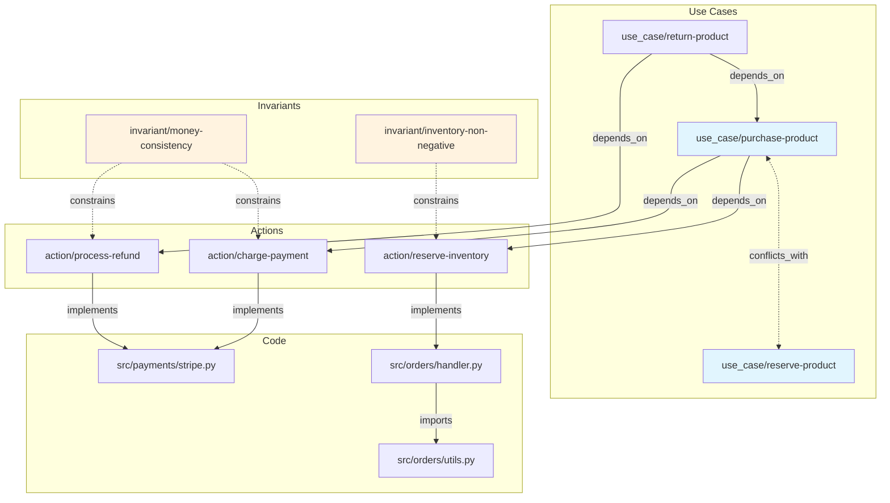

# Dependency Graph

## Overview

The dependency graph is the brain of UCF. It maintains a complete map of relationships across the entire system: what depends on what, what code implements what spec, and where conflicts exist. Every other UCF subsystem — impact analysis, coverage reporting, drift detection, conflict resolution — is a query against this graph.

The graph is built automatically from specs, code annotations, and filesystem conventions. It updates incrementally on every file change.

## Edge Types

The graph contains five edge types, each directional (or bidirectional for conflicts) with relationship metadata.

### `spec → spec` (depends_on)

```yaml
kind: use_case
name: return-product
depends_on:
  - action/purchase-product
  - action/verify-ownership
```

### `spec → code` (implements)

```yaml
kind: action
name: create-order
implemented_by: src/orders/handler.py
```

### `code → code` (imports)

Derived automatically from source-level import analysis. Changes to `utils.py` propagate impact upward through this edge.

### `spec ⟷ spec` (conflicts_with)

Bidirectional edge between specs that cannot safely execute concurrently. Always includes a resolution strategy.

```yaml
conflicts_with:
  - spec: use_case/reserve-product
    type: write-write
    resource: inventory.quantity
    strategy: optimistic-lock
    description: Both mutate inventory count simultaneously
```

### `invariant → spec` (constrains)

```yaml
kind: invariant
name: money-consistency
constrains:
  - action/purchase-product
  - action/process-refund
rule: sum(credits) == sum(debits)
```

## Building the Graph

Three mechanisms for `spec → code` mapping, evaluated in priority order (Explicit > Annotation > Convention).

**A. Convention** — action name maps to filesystem path, configurable in `ucf.yaml`:
```yaml
conventions:
  action_path: "src/{domain}/{action_name}.py"
```

**B. Annotation** — `@implements` decorator in source code:
```python
@implements("action/add-to-cart")
def handle_add_to_cart(request: AddToCartRequest) -> CartResponse:
    ...
```

**C. Explicit** — `implemented_by` field in the spec itself (highest priority).

If multiple mechanisms disagree, UCF raises a `MappingConflict` validation error.

## Graph Operations

### Impact Analysis

```
$ ucf graph impact src/payments/stripe.py

Impact Analysis: src/payments/stripe.py
════════════════════════════════════════
Direct:
  ← implements  action/process-payment
Transitive:
  ← depends_on  use_case/purchase-product
  ← depends_on  use_case/subscription-renewal
  ← constrains  invariant/money-consistency
Code dependencies:
  ← imports     src/payments/refund.py
  ← imports     src/checkout/handler.py
Affected tests:
  tests/e2e/test_purchase_flow.py
  tests/unit/test_payment_processing.py

Total impact: 3 specs, 2 code files, 2 test suites
```

### Coverage Report

```
$ ucf graph coverage

Spec Coverage
═════════════
  actions:     12/15  (80%)  ███████████████░░░░
  components:   8/8   (100%) ████████████████████
  use_cases:    6/10  (60%)  ████████████░░░░░░░░
  invariants:   4/7   (57%)  ███████████░░░░░░░░░

Code Coverage
═════════════
  src/ files linked to specs:  34/41  (83%)
  src/ files with tests:       38/41  (93%)

Orphan files (no @implements, no convention match):
  ⚠ src/legacy/old_handler.py
  ⚠ src/utils/scratch.py
```

### Conflict Map

```
$ ucf graph conflicts

Conflict Map
════════════
  purchase-product ⟷ reserve-product
    Type: write-write | Resource: inventory.quantity
    Strategy: optimistic-lock ✓ | Tests: 2 generated ✓

  apply-discount ⟷ process-refund
    Type: mutation-interference | Resource: order.total
    Strategy: ordered-pipeline ✓ | Tests: 2 generated ✓

  update-profile ⟷ merge-accounts
    Type: write-write | Resource: user.email
    Strategy: ✗ UNRESOLVED | Tests: 0 generated ✗

Summary: 3 conflict pairs, 2 resolved, 1 unresolved
```

```
$ ucf graph conflicts --with-invariants

  purchase-product ⟷ reserve-product
    Strategy: optimistic-lock ✓
    Invariants:
      ⊢ inventory-non-negative: inventory.quantity >= 0
      ⊢ money-consistency: sum(credits) == sum(debits)
```

## Conflict Detection System

The `ConflictDetector` performs static analysis on spec definitions to identify pairs of actions that cannot safely execute concurrently.

### Conflict Types

**Write-Write** — both actions write to the same resource field.

**Read-Write** — one action reads a field that another writes, leading to stale reads.

**Precondition-Postcondition** — one action's postcondition violates another's precondition.

**Mutation Interference** — both mutate the same field with non-commutative operations.

### Commutativity Rules

| Mutation A | Mutation B | Commutative | Reason |
|---|---|---|---|
| append | append | Yes | Both items present regardless of order |
| increment | increment | Yes | Addition is commutative |
| decrement | decrement | No | May violate non-negative invariants |
| set | set | No | Last-write-wins, data loss |
| multiply | add | No | `(x*a)+b ≠ (x+b)*a` |
| append | set | No | Set overwrites appended items |

### Resolution Strategies

**optimistic-lock** — read-then-write with version check, retry on mismatch:
```yaml
strategy: optimistic-lock
config: { version_field: inventory.version, max_retries: 3 }
```

**saga-compensation** — execute both, compensate on failure (distributed transactions):
```yaml
strategy: saga-compensation
config: { compensate: action/reverse-purchase, timeout: 30s }
```

**ordered-pipeline** — force sequential execution via queue:
```yaml
strategy: ordered-pipeline
config: { queue: order-mutations, ordering: fifo }
```

### Declaring Conflicts in Specs

```yaml
kind: use_case
name: purchase-product
conflicts_with:
  - spec: use_case/reserve-product
    type: write-write
    resource: inventory.quantity
    strategy: optimistic-lock
    description: Both mutate inventory count simultaneously
  - spec: use_case/flash-sale
    type: mutation-interference
    resource: product.price
    strategy: ordered-pipeline
    description: Discount calculations are order-dependent
```

### Auto-Generated Conflict Tests

For each declared conflict pair, UCF generates concurrent execution tests verifying the resolution strategy:

```python
@generated_by("ucf/conflict-detector")
class TestPurchaseReserveConflict:
    async def test_concurrent_write_write(self):
        setup_inventory(product_id="SKU-1", quantity=1)
        results = await run_concurrent(
            purchase_product(product_id="SKU-1"),
            reserve_product(product_id="SKU-1"),
        )
        assert count_succeeded(results) == 1
        assert count_retried(results) <= 3
        assert get_inventory("SKU-1").quantity == 0

    async def test_optimistic_lock_retry(self):
        setup_inventory(product_id="SKU-2", quantity=10)
        results = await run_concurrent(
            *[purchase_product(product_id="SKU-2") for _ in range(5)]
        )
        assert get_inventory("SKU-2").quantity == 5
```

## Mermaid Visualization



## CLI Commands

```
ucf graph impact <spec>             Trace all transitive dependents
ucf graph coverage                  Spec and code coverage report
ucf graph conflicts                 List conflict pairs with resolution status
ucf graph conflicts --with-invariants   Conflicts enriched with invariant constraints
ucf graph --orphans                 Code files with no spec linkage
ucf graph --visualize               Generate Mermaid dependency diagram
ucf trace <action-name>             Full dependency chain for a single action
```

### `ucf graph --orphans`

```
$ ucf graph --orphans

Orphan Files (no spec linkage)
══════════════════════════════
  src/legacy/old_handler.py      no @implements, no convention match
  src/utils/scratch.py           no @implements, no convention match
  src/migrations/v2_compat.py    no @implements, excluded by pattern

Total: 3 orphan files
```

### `ucf graph --visualize`

```
$ ucf graph --visualize

Generated: docs/generated/dependency-graph.md
  Nodes: 34 (12 actions, 8 components, 6 use cases, 8 code files)
  Edges: 47 (15 depends_on, 12 implements, 14 imports, 3 conflicts, 3 constrains)
```

### `ucf trace <action-name>`

```
$ ucf trace action/charge-payment

Trace: action/charge-payment
═════════════════════════════
  Code Layer:
    src/payments/stripe.py
      ← imports  src/payments/types.py
      ← imports  src/common/http_client.py
  Spec Layer:
    action/charge-payment
      ← depends_on  use_case/purchase-product
      ← depends_on  use_case/subscription-renewal
  Invariant Layer:
    invariant/money-consistency
      rule: sum(credits) == sum(debits)
  Conflict Layer:
    ⟷ use_case/reserve-product (write-write on inventory.quantity)
      strategy: optimistic-lock ✓
```
